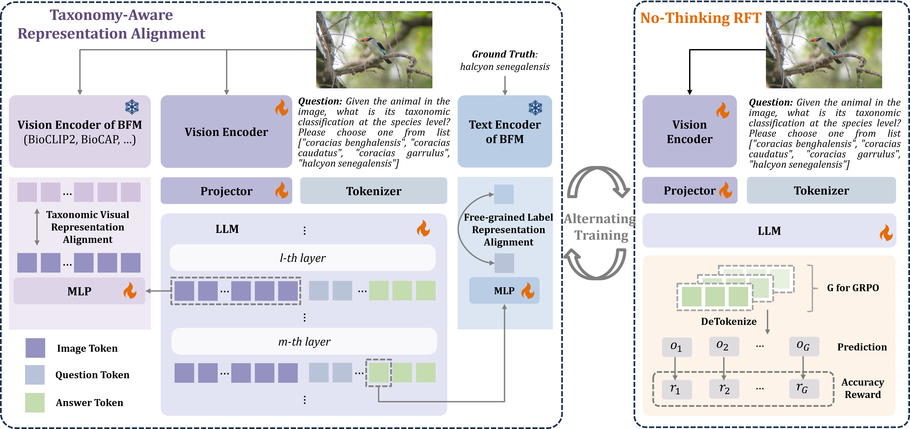
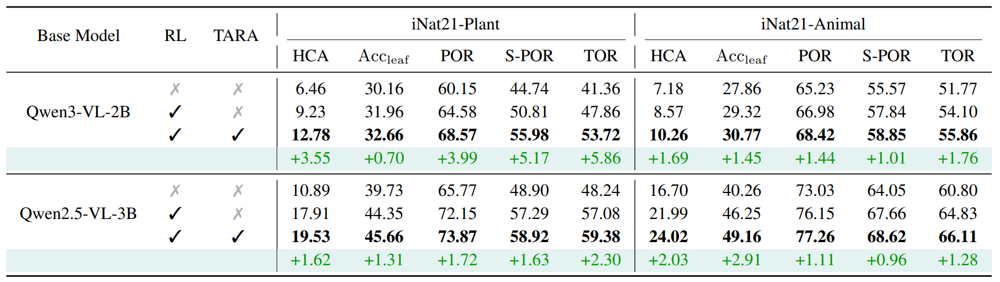

<!-- PROJECT LOGO -->

<p align="center">
  <h1 align="center">Taxonomy-Aware Representation Alignment for Hierarchical Visual Recognition with Large Multimodal Models</h1>
  <p align="center">
    <a href="http://39.108.48.32/mipl/news/news.php?id=EGhehulingxiao"><strong>Hulingxiao He</strong></a>
    ·
    <a href="http://39.108.48.32/mipl/news/news.php?id=EGtanzhi"><strong>Zhi Tan</strong></a>
    ·
    <a href="http://39.108.48.32/mipl/yuxinpeng/"><strong>Yuxin Peng</strong></a>
  </p>
  <h2 align="center">CVPR 2026</h2>
<div align="center"></div>


  <h3 align="center"><a href="https://arxiv.org/abs/2603.00431">Paper</a> | <a href="https://huggingface.co/datasets/StevenHH2000/iNat21-1shot-fewshots">Data</a>


</div>

## 🔥 News 
- **Mar 2026:** 🌼🌼🌼 Code is available now. Welcome to follow our work and give us a star 🌟! 
- **Feb 2026:** 🎉🎉🎉 TARA is accepted to CVPR 2026! See you in Denver this June!

## 🧠 More Related Research
- **Fine-R1** (ICLR 2026): the first MLLM to surpass various strong CLIP-like models (e.g., SigLIP-L) in FGVR. 【[Paper](https://arxiv.org/abs/2602.07605)】【[Code](https://github.com/PKU-ICST-MIPL/FineR1_ICLR2026)】
- **Finedefics** (ICLR 2025): revisiting three quintessential capabilities of MLLMs for FGVR and position of the root cause as a misalignment problem. 【[Paper](https://arxiv.org/abs/2501.15140)】【[Code](https://github.com/PKU-ICST-MIPL/Finedefics_ICLR2025)】


## 🌟 **Motivation**

Large Multimodal Models **struggle with hierarchical visual recognition (HVR)**, failing to obey the hierarchical consistency on both known and novel categories.

<div align="center">

</div>

## 📖 **Methodology**

We propose **Taxonomy-Aware Representation Alignment (TARA)**, a simple but effective framework that explicitly aligns intermediate representations of LMMs with visual and text features from pretrained Biology Foundation Models (BFMs), thereby injecting taxonomic knowledge and enabling richer, hierarchy-aware visual recognition.

<div align="center">

</div>

### **Main Results**

Experiments demonstrate that TARA consistently enhances LMMs’ **hierarchical consistency** and **leaf node accuracy**, enabling reliable recognition of both known and novel categories within complex biological taxonomies.

<div align="center">

</div>

### 🛠️ Installation

```bash
cd CLS-RL
conda create -n cls-rl python=3.11
conda activate cls-rl
bash setup.sh
pip install flash-attn==2.7.2.post1 --no-build-isolation
(Optional) export HF_ENDPOINT=https://hf-mirror.com
```


### 🔥 Training

#####  Data Preparation

Download 1-shot training data of iNaturalist-2021 from [Hugging Face](https://huggingface.co/datasets/StevenHH2000/iNat21-1shot-fewshots) and put it under the directory `CLS-RL/data`.

##### No-Thinking RFT (baseline)
```bash
# Qwen3-VL-2B
bash fewshot_no-think-qwen3.sh
# Qwen2-VL-2B
bash fewshot_no-think-qwen2.sh
```

##### No-Thinking RFT + TARA (ours)
```bash
# Qwen3-VL-2B
bash fewshot_no-think-tara-qwen3.sh
# Qwen2-VL-2B
bash fewshot_no-think-tara-qwen2.sh
```

### 📋 Evaluation

#####  Data Preparation

Update image paths in the JSON files `LLM-Hierarchical-Consistency/data/annotations/similar_choices/inat21_animalia_with_similar_choice_new_sample1.jsonl` and `LLM-Hierarchical-Consistency/data/annotations/similar_choices/inat21_plantae_with_similar_choice_new_sample1.jsonl` to point to your image directory. Note that we randomly sample 1-shot data for fast evaluation in our work.

##### No-Thinking RFT (baseline)
```bash
cd LLM-Hierarchical-Consistency
bash scripts/baselines.sh
```

##### No-Thinking RFT + TARA (ours)
```bash
cd LLM-Hierarchical-Consistency
bash scripts/ours.sh
```

## 🥰 Acknowledgements

We thank the [CLS-RL](https://github.com/minglllli/CLS-RL) and [LLM-Hierarchical-Consistency](https://github.com/yuanqing-ai/LLM-Hierarchical-Consistency) for providing the foundational codebase that we adapted to implement TARA. 

## 📝 Citation
If you find it useful for your research and applications, please cite related papers using this BibTeX:
```bibtex
@article{he2026taxonomy,
  title={Taxonomy-Aware Representation Alignment for Hierarchical Visual Recognition with Large Multimodal Models},
  author={He, Hulingxiao and Tan, Zhi and Peng, Yuxin},
  journal={arXiv preprint arXiv:2603.00431},
  year={2026}
}

@article{he2026fine,
  title={Fine-R1: Make Multi-modal LLMs Excel in Fine-Grained Visual Recognition by Chain-of-Thought Reasoning},
  author={He, Hulingxiao and Geng, Zijun and Peng, Yuxin},
  journal={arXiv preprint arXiv:2602.07605},
  year={2026}
}

@article{he2025analyzing,
  title={Analyzing and boosting the power of fine-grained visual recognition for multi-modal large language models},
  author={He, Hulingxiao and Li, Geng and Geng, Zijun and Xu, Jinglin and Peng, Yuxin},
  journal={arXiv preprint arXiv:2501.15140},
  year={2025}
}
```

## 📄 License

This project is licensed under the MIT License.

---

<div align="center">


</div>